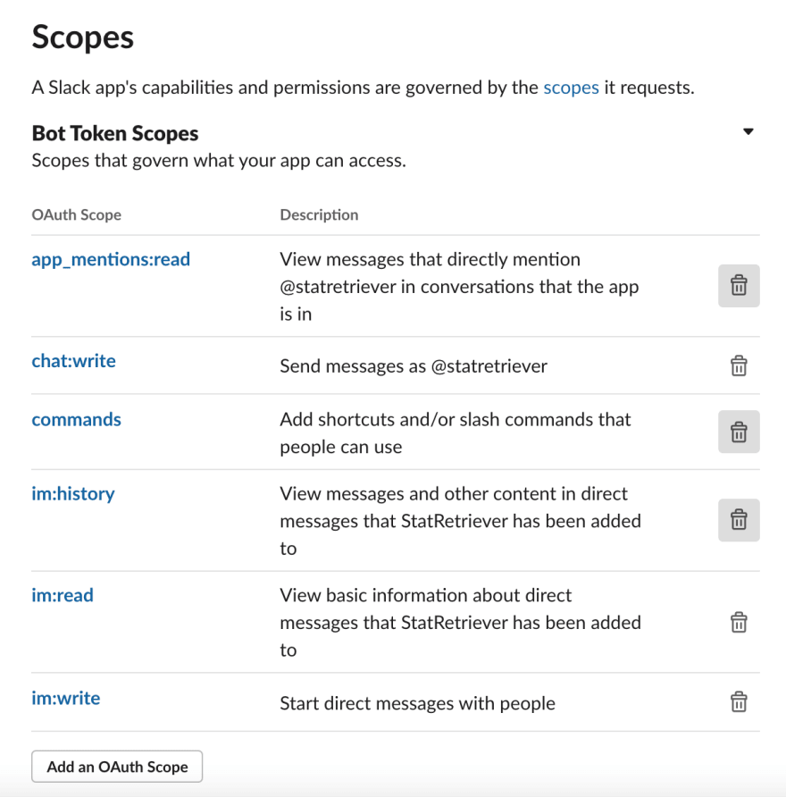

# SLACK CODACY BOT

A Nodejs App for Slack to get automated info from your Codacy's organization repos code analysis.

## Features

- Monthly Ranking (top 10 best graded repos)
- /codacy command to get specific repository info

## Requirements

- create a new Slack app on your workspace (https://app.slack.com/apps-manage);
- go to App-Level Tokens and generate a new Token. Give this token the scopes "connections: write" and "authorizations: read";
- go to Socket Mode and enable Socket Mode to allow connection to the Slack API with WebSockets;
- go to OAuth & Permissions, in the Scopes section, add the following Bot Token Scopes:
  
- create a Slash Command: /codacy
- in you Codacy account > Access Management, create a new API Token

## Installation

- clone the repo
- create a .env file from .env.example and fill the missing info
- run `npm install`
- run `node index.js`
